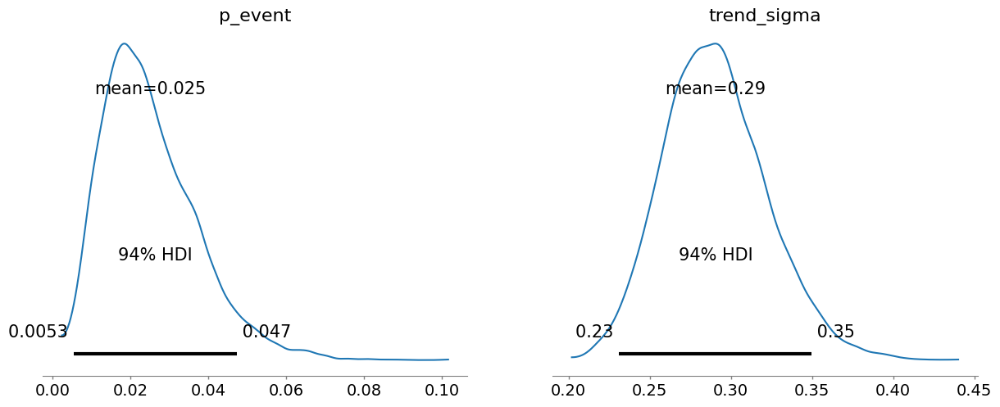
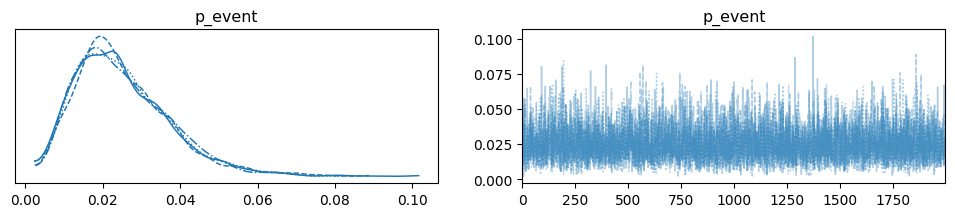
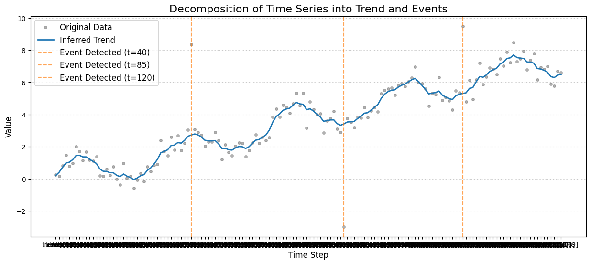
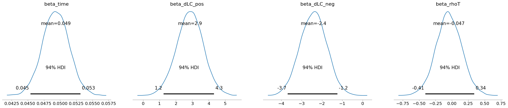
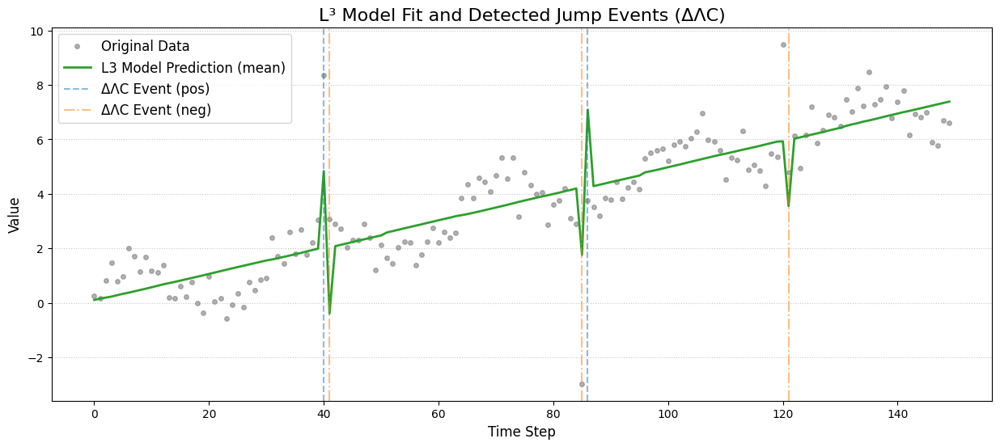

# bayesian-event-detector

A minimal sample for detecting time-series jump events using Bayesian inference.

---

## 🚀 Concept

This repository demonstrates a paradigm shift in time-series analysis:

> Instead of forcing all data to fit a single smooth law, our model explicitly separates "smooth trend" and "jump (event)" states, expressing reality as a *mixture of processes*.
> Each parameter has a clear, human-interpretable meaning—allowing users not only to detect *when* and *where* an event occurred, but also *why* it occurred and with what certainty.

---

## Overview

This repository provides a minimal example for automatically detecting “jump (spike) events” in time-series data using Bayesian inference.
It includes dummy data generation, PyMC modeling, and optional result visualization—all in one script.

---

## Usage

1. **Install required packages:**

   ```bash
   pip install -r requirements.txt
   ```
2. **Run the sample code:**

   ```bash
   python event_jump_detector.py
   ```
3. **(Optional)**

   Uncomment the visualization lines in the script to plot the results.

---

## File Description

* `event_jump_detector.py` ... Main sample code
* `requirements.txt` ... List of required Python packages
* `README.md` ... This description

---

## Example Output

### Bayesian Decomposition (Classic Model)



**Posterior for event probability:**



**Posterior for trend and event parameters:**




## Advanced Usage: Visualization Example

The following script shows how to visualize the decomposition of your time series into the inferred trend and detected event points (where the probability of an event exceeds 50%).

```python
import matplotlib.pyplot as plt
import numpy as np

# Obtain summary statistics from the trace
summary = az.summary(trace, var_names=['trend', 'event_indicator', 'jump_effect'])

# Extract posterior means for trend and event indicator
mean_trend = summary['mean'][summary.index.str.startswith('trend')]
event_prob = summary['mean'][summary.index.str.startswith('event_indicator')]

fig, ax = plt.subplots(figsize=(15, 6))
ax.plot(data, 'o', color='gray', markersize=4, alpha=0.6, label='Original Data')
ax.plot(mean_trend, color='C0', lw=2, label='Inferred Trend')

# Highlight detected events (posterior probability > 0.5)
event_detected_indices = np.where(event_prob > 0.5)[0]
for idx in event_detected_indices:
    ax.axvline(x=idx, color='C1', linestyle='--', alpha=0.7, label=f'Event Detected (t={idx})')

ax.set_title('Decomposition of Time Series into Trend and Events', fontsize=16)
ax.set_xlabel('Time Step', fontsize=12)
ax.set_ylabel('Value', fontsize=12)

# Remove duplicate labels
handles, labels = ax.get_legend_handles_labels()
by_label = dict(zip(labels, handles))
ax.legend(by_label.values(), by_label.keys(), fontsize=12)

plt.grid(axis='y', linestyle=':', alpha=0.7)
plt.show()

print("\nDetected event time points:")
print(event_detected_indices)
```

---

## Lambda³ Model: Paradigm Shift for Transactional Time-Series

**File:** `lambda3_jump_event_detector.py`

A next-generation Bayesian regression model implementing Lambda³ theory (Λ³), focusing on “jump events,” trends, and local volatility. This approach uses **transaction index** rather than physical time, and separates jump directions.

### Key features:

* Directional jump detection (positive/negative)
* Full Bayesian coefficient estimation for interpretability
* Transaction-index based progress (can be time, transaction ID, or order)
* Plug-and-play for science, finance, biology, and engineering

### Lambda³ Model Example Output

**Fit:**



**Posterior:**



---

## License

MIT License

---

## Citation & Contact

If this work inspires you, please cite it.
For theoretical discussions, practical applications, or collaboration proposals,
contact the repository author or simply open an issue/PR.

Let’s make explainable, universal science the new standard—together.

---
**Let’s make explainable science the new standard.**
---

## Author & Copyright

© Iizumi Masamichi 2025  
Contributors / Digital Partners:  Tamaki, Mio, Tomoe, Shion, Yuu, Rin, Kurisu
All rights reserved.

Science is not property; it's a shared horizon.
Let's redraw the boundaries, together.
— Iizumi & Digital Partners

---

